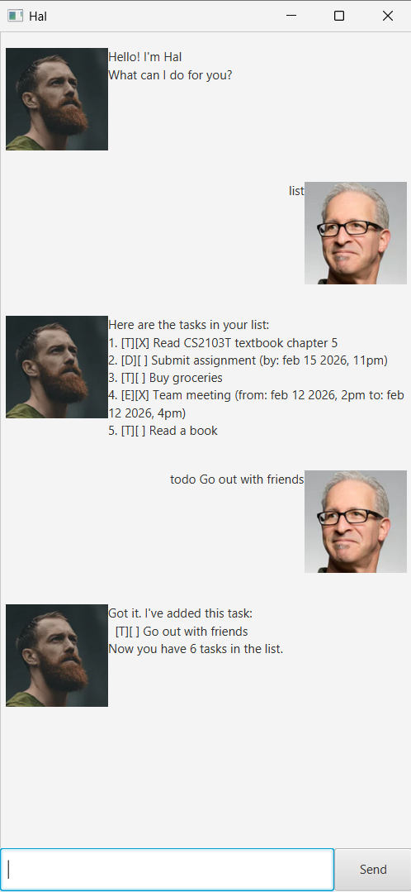

# Hal User Guide

Hal is a **desktop app for managing tasks, optimized for use via a Command Line Interface** (CLI) while still having the benefits of a Graphical User Interface (GUI). If you can type fast, Hal can get your task management done faster than traditional GUI apps.

## Quick start

1. Ensure you have Java `17` or above installed in your Computer.

2. Download the latest `.jar` file from [here](https://github.com/verudex/ip/releases).

3. Copy the file to the folder you want to use as the _home folder_ for your Hal.

4. Open a command terminal, `cd` into the folder you put the jar file in, and use the `java -jar hal.jar` command to run the application. A GUI should open up.

5. Type the command in the input box at the bottom and press Enter to execute it. e.g. typing `list` and pressing Enter will show all your tasks.
   Some example commands you can try:

   * `list` : Lists all tasks.
   
   * `todo Buy groceries` : Adds a todo task named `Buy groceries` to the task list.
   
   * `deadline Submit assignment /by 15/02/2026 2359` : Adds a deadline task named `Submit assignment` with deadline on 15 Feb 2026, 11:59 PM.
   
   * `mark 1` : Marks the 1st task shown in the current list as done.
   
   * `delete 3` : Deletes the 3rd task shown in the current list.
   
   * `bye` : Exits the app.

6. Refer to the [Features](#features) below for details of each command.

--------------------------------------------------------------------------------------------------------------------

## Features

> [!NOTE]
> **Notes about the command format:**
>
> * Words in `UPPER_CASE` are the parameters to be supplied by the user.
>   e.g. in `todo DESCRIPTION`, `DESCRIPTION` is a parameter which can be used as `todo Read book`.
>
> * Parameters must be in the order specified.
>   e.g. if the command specifies `deadline DESCRIPTION /by DATETIME`, you cannot swap the order.
>
> * Extraneous parameters for commands that do not take in parameters (such as `list` and `bye`) will be ignored.
>   e.g. if the command specifies `list 123`, it will be interpreted as `list`.
>
> * Date and time must be in the format `dd/MM/yyyy HHmm`.
>   e.g. `15/02/2026 2359` represents 15 February 2026, 11:59 PM.

### Listing all tasks : `list`

Shows a list of all tasks in your task list.

Format: `list`

Example:
* `list` displays all tasks with their completion status.

### Adding a todo task: `todo`

Adds a todo task to the task list.

Format: `todo DESCRIPTION`

Examples:
* `todo Read CS2103T textbook chapter 5`
* `todo Buy groceries`
* `todo Call dentist for appointment`

> [!TIP]
> A todo task can have any description, but it cannot be empty!

### Adding a deadline task: `deadline`

Adds a deadline task with a specific deadline to the task list.

Format: `deadline DESCRIPTION /by DD/MM/YYYY HHMM`

* The deadline must be in the format `dd/MM/yyyy HHmm`.
* e.g. `15/02/2026 2359` represents 15 February 2026, 11:59 PM.

Examples:
* `deadline Submit assignment /by 15/02/2026 2359`
* `deadline Return library books /by 28/02/2026 1800`
* `deadline Pay electricity bill /by 20/02/2026 1700`

### Adding an event task: `event`

Adds an event with a start and end time to the task list.

Format: `event DESCRIPTION /from DD/MM/YYYY HHMM /to DD/MM/YYYY HHMM`

* Both start and end times must be in the format `dd/MM/yyyy HHmm`.

Examples:
* `event Team meeting /from 12/02/2026 1400 /to 12/02/2026 1600`
* `event Birthday party /from 15/02/2026 1900 /to 15/02/2026 2300`
* `event Project presentation /from 20/02/2026 1000 /to 20/02/2026 1130`

### Marking a task as done : `mark`

Marks the specified task as done.

Format: `mark INDEX`

* Marks the task at the specified `INDEX` as done.
* The index refers to the index number shown in the displayed task list.
* The index **must be a positive integer** 1, 2, 3, …

Examples:
* `list` followed by `mark 2` marks the 2nd task in the task list as done.
* `find book` followed by `mark 1` marks the 1st task in the results of the `find` command as done.

### Unmarking a task : `unmark`

Marks the specified task as not done.

Format: `unmark INDEX`

* Marks the task at the specified `INDEX` as not done.
* The index refers to the index number shown in the displayed task list.
* The index **must be a positive integer** 1, 2, 3, …

Examples:
* `list` followed by `unmark 2` marks the 2nd task in the task list as not done.
* `find book` followed by `unmark 1` marks the 1st task in the results of the `find` command as not done.

### Locating tasks by description: `find`

Finds tasks whose descriptions contain any of the given keywords.

Format: `find KEYWORD [MORE_KEYWORDS]`

* The search is case-insensitive. e.g. `book` will match `Book`
* Only the description is searched.
* Tasks matching at least one keyword will be returned (i.e. `OR` search).
  e.g. `read book` will return tasks containing `read` OR `book`

Examples:
* `find book` returns `Read book` and `Buy book`
* `find assignment project` returns tasks containing either `assignment` or `project`

### Deleting a task : `delete`

Deletes the specified task from the task list.

Format: `delete INDEX`

* Deletes the task at the specified `INDEX`.
* The index refers to the index number shown in the displayed task list.
* The index **must be a positive integer** 1, 2, 3, …

Examples:
* `list` followed by `delete 2` deletes the 2nd task in the task list.
* `find book` followed by `delete 1` deletes the 1st task in the results of the `find` command.

### Exiting the program : `bye`

Exits the program.

Format: `bye`

### Saving the data

Hal data are saved in the hard disk automatically after any command that changes the data.
There is no need to save manually.

### Editing the data file

Hal data are saved automatically as a text file `[JAR file location]/data/hal.txt`. Advanced users are welcome to update data directly by editing that data file.

> [!CAUTION]
> If your changes to the data file makes its format invalid, Hal will discard all data and start with an empty data file at the next run. Hence, it is recommended to take a backup of the file before editing it.
>
> Furthermore, certain edits can cause Hal to behave in unexpected ways (e.g., if a value entered is outside the acceptable range). Therefore, edit the data file only if you are confident that you can update it correctly.

--------------------------------------------------------------------------------------------------------------------

## Command summary

| Action | Format, Examples |
|--------|------------------|
| **List** | `list` |
| **Todo** | `todo DESCRIPTION` e.g., `todo Read CS2103T textbook chapter 5` |
| **Deadline** | `deadline DESCRIPTION /by DD/MM/YYYY HHMM` e.g., `deadline Submit assignment /by 15/02/2026 2359` |
| **Event** | `event DESCRIPTION /from DD/MM/YYYY HHMM /to DD/MM/YYYY HHMM` e.g., `event Team meeting /from 12/02/2026 1400 /to 12/02/2026 1600` |
| **Mark** | `mark INDEX` e.g., `mark 3` |
| **Unmark** | `unmark INDEX` e.g., `unmark 3` |
| **Find** | `find KEYWORD [MORE_KEYWORDS]` e.g., `find book assignment` |
| **Delete** | `delete INDEX` e.g., `delete 3` |
| **Exit** | `bye` |